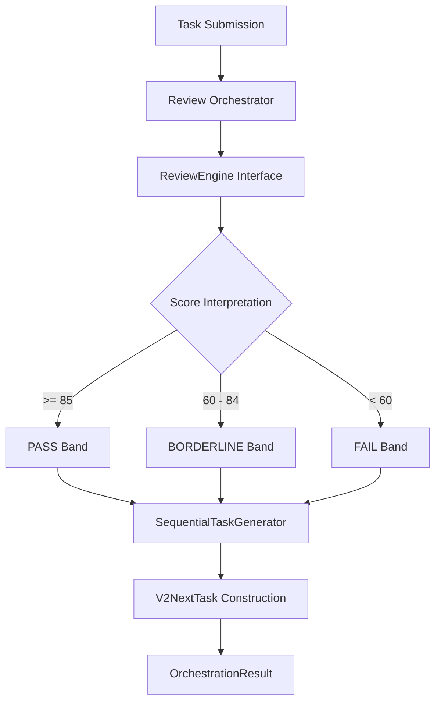

# Autonomous Review Orchestrator (V2)
## Product Documentation & System Architecture

### 1. Product Vision
The **Autonomous Review Orchestrator** represents the evolution of the Task Review Agent from a passive feedback tool into a proactive workflow driver. By closing the loop between technical evaluation and future task assignment, the system enables an autonomous cycle of "Review-Refine-Progress." Our vision is to eliminate engineering ambiguity by providing immediate, deterministic, and actionable technical roadmaps based on task readiness.

### 2. Demo Freeze & System Stability
This system is currently under a **Feature Freeze**. Logic regarding score-to-band mapping and task generation is locked to ensure:
*   **Zero Variance**: Identical inputs yield bit-for-bit identical outputs. (See [V1 Stability Report](./V1_TEST_REPORT.md))
*   **Predictable Latency**: Deterministic execution paths eliminate "noise" during live demonstrations.
*   **Verification**: Byte-stability verified via 1,000-run hash checks (See `tests/test_determinism_loop.py`).

---

### 3. Autonomous Flow Diagram
The orchestrator acts as the "Brain," managing the high-level decision tree without modifying the underlying engines.



---

### 4. Integration Boundaries
The Orchestrator maintains strict boundaries between systemic layers:
*   **Core Logic Layer**: `ReviewEngine` (Pure analysis).
*   **Strategy Layer**: `SequentialTaskGenerator` (Workflow mapping).
*   **Orchestration Layer**: `ReviewOrchestrator` (Safe execution & observability).

It consumes interfaces (`ReviewEngineInterface`, `NextTaskGeneratorInterface`) rather than concrete classes, allowing for seamless component swapping without changing the orchestration pipeline.

---

### 5. Deterministic Guarantees
The system enforces strict score bands to ensure repeatable classifications:
| Score Band | Classification | Outcome Mapping |
| :--- | :--- | :--- |
| **85 - 100** | **PASS** | Stretch Task (Advanced Engineering) |
| **60 - 84** | **BORDERLINE** | Reinforcement Task (Technical Debt/Refactor) |
| **0 - 59** | **FAIL** | Correction Task (Core Requirements) |

*Calculations use integer clamping (0-100) to ensure overflow/underflow does not disrupt logic.*

---

### 6. API Contract
**Endpoint**: `POST /api/v1/orchestration/process`

**Response Structure**:
```json
{
  "review": {
    "score": 90,
    "status": "pass",
    "analysis": { ... },
    "next_task": { ... } // Nested for backward compatibility
  },
  "readiness_classification": "PASS",
  "next_task": {
    "title": "System Scalability...",
    "objective": "Stretch Task...",
    "focus_area": "Performance...",
    "difficulty": "hard"
  }
}
```

---

### 7. Extension Points & Future Path
The v2 architecture is designed for "Painless Evolution":

#### **Immediate Extension Points**
*   **Custom Templates**: Edit `app/models/task_templates.py` to update deterministic task content.
*   **Dependency Injection**: Use `app/core/dependencies.py` to swap the rule-based generator for a different implementation.

#### **Future Plug-in Path (ML/Hybrid)**
The system is ready for **V3: High-Context Intelligence**:
1.  **ML-Generator Plug-in**: Implement the `NextTaskGeneratorInterface` using LLM/ML models for hyper-personalized task generation.
2.  **Hybrid Review**: Inject a `ReviewEngineInterface` that combines rule-based heuristics with probabilistic AI analysis, while the Orchestrator maintains the "Safety Guardrails" (e.g., overriding AI failures with deterministic fallbacks).

---
*Authorized by: Backend Architecture Team*
*Status: [DEMO-READY / PROD-LOCKED]*
